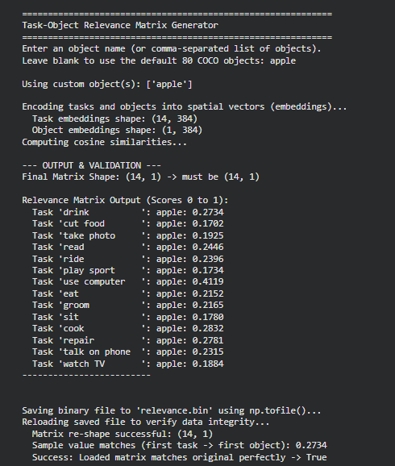
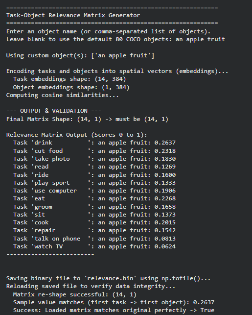
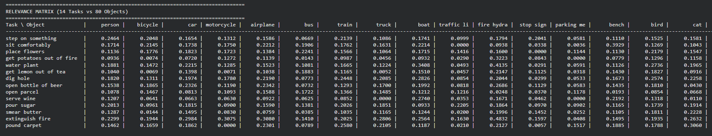

# 1.Task-Object Semantic Relevance Matrix

This project dynamically generates a semantic relevance matrix between predefined human tasks (e.g., "drink", "use computer") and objects (like COCO dataset objects). It uses AI to build a logical map of "what objects are used for what tasks" without requiring manual hard-coding of every single rule.

## How It Works

The core logic relies on **Semantic Embedding** using AI:

1. **Translating Words to Math (Embeddings):** 
   We pass human tasks and objects into the `Sentence-BERT` model (`all-MiniLM-L6-v2`). This AI has learned human language by reading millions of articles, books, and internet pages. It converts each word into a **384-dimensional mathematical vector** (a coordinate on a giant 384D map of concepts). 

2. **Comparing Meanings (Cosine Similarity):** 
   Words that are frequently used together or share similar contexts end up physically closer to each other on this map. To see how related a task is to an object, we calculate the **Cosine Similarity**—the mathematical angle between the two vectors. 

3. **The Matrix:** 
   A score near `1.0` means the items are highly related (small angle), while a score near `0.0` means they are completely unrelated. The script generates a matrix (grid) of all these overlapping scores and saves it as a binary file (`relevance.bin`) for use in other applications.

---

## The "Apple" Anomaly: AI Language Bias

When running the matrix, you might notice an interesting anomaly: the object `"apple"` scores unusually high (e.g., ~0.41) in relevance to the task `"use computer"`, sometimes scoring even higher than `"eat"` or `"cut food"`.

**Why does this happen?**

This is a classic example of **AI Language Bias** and **Polysemy** (words having multiple meanings). 

Sentence-BERT doesn't have physical eyes; it only knows the world through text from the internet. Think about how the word "apple" is used online:
* While it is a fruit, a massive percentage of internet text uses the word **Apple** to refer to **Apple Inc.** (MacBooks, iPhones, Apple Watches, iPads).
* Because Sentence-BERT was trained on news articles, Wikipedia, and tech blogs, the mathematical vector for `"apple"` is heavily "pulled" toward the concept of **technology, electronics, and computing**.
* Therefore, when it compares the vector for `"apple"` with the vector for `"use computer"`, the math assumes *"These two concepts show up in the same context all the time!"* and awards a high similarity score.

### Output Screenshot


### How to Fix This
If you want the AI to strictly think of the physical fruit and ignore the tech company, you must provide more context so the AI plots the vector differently. Instead of passing just `"apple"` to the model, passing:
`"an apple fruit"` or `"a fresh apple for eating"`
...will instantly shift the vector away from "computers" and move it toward "food", completely correcting the scores.

### Output Screenshot


## Installation & Usage

1. Install the required dependencies:
   ```bash
   pip install sentence-transformers scikit-learn numpy
   ```

2. Run the main generator script:
   ```bash
   python mainMain.py
   ```
   *You can either input a custom comma-separated list of objects to generate a dynamic matrix, or press Enter to fall back to the default 80 COCO objects.*

# 2.Task-Object Relevance Matrix Generator

This repository contains a Python script (`main.py`) that uses Natural Language Processing (NLP) to dynamically evaluate and score the semantic relevance between human tasks and real-world objects. 

Specifically, it maps **14 predefined tasks** (derived from the COCO-Tasks dataset) against **80 standard COCO dataset objects**, generating a 14x80 relevance matrix.

## 🚀 Features

- **Semantic Embedding**: Uses the highly efficient Sentence-BERT model (`all-MiniLM-L6-v2`) to convert task and object names into 384-dimensional spatial vectors.
- **Cosine Similarity**: Computes the mathematical angle (cosine similarity) between task and object vectors to determine how closely they relate contextually.
- **Matrix Normalization**: Scales the resulting values between `0.0` and `1.0`, where `1.0` means a perfect semantic match.
- **Console Matrix Output**: Prints the generated 14x80 matrix directly to the console as an easy-to-read table.
- **Top Match Extraction**: 
  - Iterates through all 80 objects to recommend the **single best task** suited for each object.
  - Automatically scans the *entire* 14x80 matrix to find the **absolute highest relevance score**, declaring the ultimate best task-object pairing.
- **Binary Export**: Automatically converts the matrix to 32-bit floating-point precision and saves it locally as a raw binary file (`relevance.bin`) for use in downstream machine learning or robotics applications.
- **Data Integrity Verification**: Automatically reloads the saved binary file and cross-checks it against the original matrix to ensure zero data corruption during export.

## 🛠️ Prerequisites

To run this script, you will need a Python environment (Python 3.7+ recommended) with the following libraries installed:

```bash
pip install numpy sentence-transformers scikit-learn
```

## 📋 The Data

### The 14 Tasks
1. step on something
2. sit comfortably
3. place flowers
4. get potatoes out of fire
5. water plant
6. get lemon out of tea
7. dig hole
8. open bottle of beer
9. open parcel
10. serve wine
11. pour sugar
12. smear butter
13. extinguish fire
14. pound carpet

### The 80 Objects
The script uses the standard 80 categories from the MS COCO (Common Objects in Context) dataset, including items like `person`, `bicycle`, `bottle`, `wine glass`, `couch`, `scissors`, `fire hydrant`, etc.

### Output Screenshot


## 💻 Usage

Run the script directly from your terminal or command prompt:

```bash
python main.py
```

### Expected Output Process:
1. **Model Loading**: Sentence-BERT will initialize (might download the ~80MB model on the first run).
2. **Embedding & Computation**: The script converts the words to vectors and computes the 14x80 similarity matrix.
3. **Table Generation**: A large table mapping the tasks (rows) to the objects (columns) will be printed.
4. **Best Task for Each Object**: You will see a list detailing the best-suited task for each of the 80 objects.
5. **Overall Best Match**: The script will print the absolute highest score found in the entire matrix.
6. **Save & Verify**: It confirms that `relevance.bin` was saved and successfully reloaded without data loss.

## 📁 Output Files

- `relevance.bin`: A raw binary file containing a flat array of `float32` values representing the 14x80 matrix. This can be loaded into C++, Python, or other languages using standard byte-reading functions (e.g., `numpy.fromfile()`).
